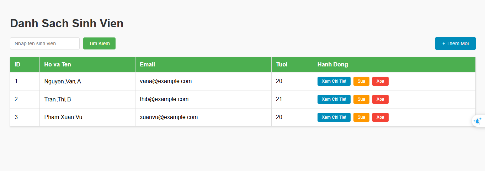
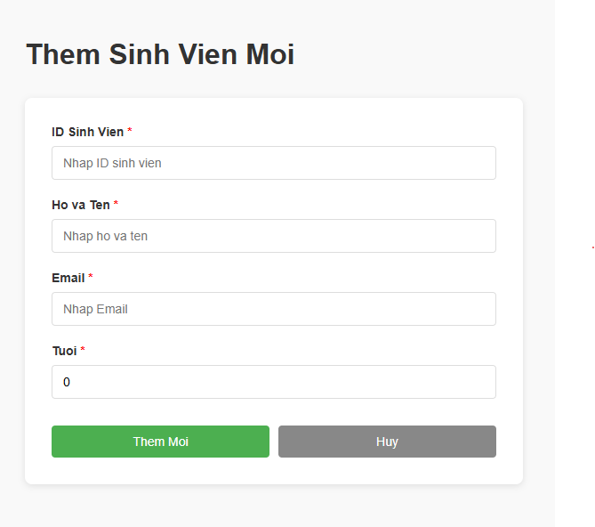
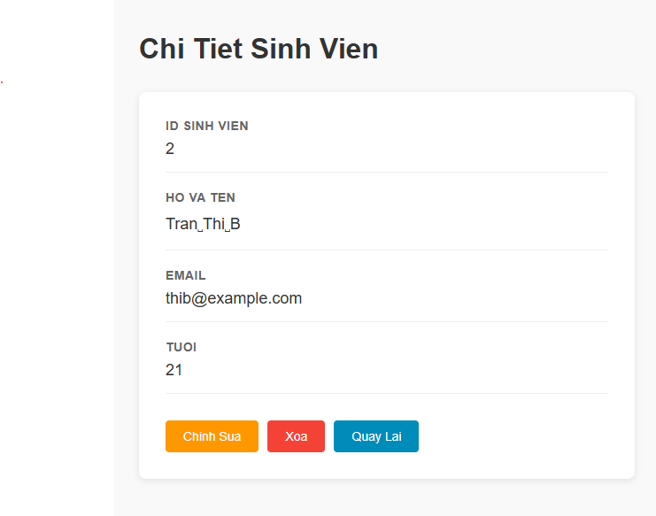

# Student Management System

## 1. Danh sách nhóm (Group Members)

| STT | Họ và tên | MSSV |
|-----|-----------|------|
| 1 | Phạm Xuân Vũ | 2313966 |
=

---

## 2. Public URL Web Service (Lab 5 - Deployment)

**Deployed URL:** https://student-management-d6v3.onrender.com/students


## 3. Hướng dẫn cách chạy dự án

### 3.1 Yêu cầu hệ thống (System Requirements)
- Java 21 JDK
- Maven 3.9+
- Docker (optional - để chạy với Docker)

### 3.2 Chạy trực tiếp (Run directly)

```bash
# Clone repository
git clone https://github.com/Vupiad/Student-Management.git
cd student-management

# Build và chạy
mvn clean package
java -jar target/student-management-0.0.1-SNAPSHOT.jar
```

Ứng dụng sẽ chạy tại: `http://localhost:8080`

### 3.3 Chạy với Docker

```bash
# Build Docker image
docker build -t student-management .

# Chạy container
docker run -p 8080:8080 student-management
```

Ứng dụng sẽ accessible tại: `http://localhost:8080`

### 3.4 Cấu hình Database

Chỉnh sửa file `src/main/resources/application.properties`:

```properties
spring.datasource.url=jdbc:mysql://localhost:3306/student_management
spring.datasource.username=root
spring.datasource.password=your_password
spring.jpa.hibernate.ddl-auto=update
```

---

## 4. Bài tập thực hành (Lab Exercises)


### 4.2 Bài 2: Ràng buộc Khóa Chính
**Yêu cầu:** Cố tình insert sinh viên có ID trùng với người đã có.

**Lỗi dự kiến:** `UNIQUE constraint failed: student.id`

**Giải thích:** Primary Key đảm bảo mỗi ID duy nhất, tránh trùng lặp dữ liệu.

---

### 4.3 Bài 3: Toàn vẹn dữ liệu (Constraints)
**Yêu cầu:** Insert sinh viên nhưng bỏ trống name (NULL).

**Kết quả:** Database có thể không báo lỗi, song code Java sẽ gặp NullPointerException khi truy cập `student.getName()`.

**Giải pháp:** Thêm `@Column(nullable = false)` trong Entity hoặc validate ở Service layer.

---

### 4.4 Bài 4: Cấu hình Hibernate
**Vấn đề:** Tại sao dữ liệu bị mất mỗi lần chạy lại?

**Nguyên nhân:** `spring.jpa.hibernate.ddl-auto=create-drop` sẽ drop bảng khi tắt ứng dụng.

**Giải pháp:** Thay đổi thành `update` để giữ dữ liệu:
```properties
spring.jpa.hibernate.ddl-auto=update
```

| Giá trị | Chức năng |
|--------|----------|
| `create-drop` | Drop + Create lại mỗi lần (Testing) |
| `create` | Create lại bảng (Testing) |
| `update` | Chỉ update schema (Development) |
| `validate` | Chỉ validate (Production) |

---

## 5. Screenshots cho các module trong Lab 4

### 5.1 Trang danh sách học sinh (Students List Page)



**Chức năng:**
- Hiển thị danh sách tất cả các học sinh
- Nút "Add New Student" để thêm học sinh mới
- Nút "Edit" để chỉnh sửa thông tin học sinh
- Nút "Delete" để xóa học sinh
- Nút "View Detail" để xem chi tiết

### 5.2 Trang thêm/sửa học sinh (Form Page)



**Chức năng:**
- Form input với các trường: Name, Email, Phone, Address
- Validation trên phía client
- Submit button để lưu dữ liệu
- Cancel button quay lại danh sách

### 5.3 Trang chi tiết học sinh (Student Detail Page)



**Chức năng:**
- Hiển thị đầy đủ thông tin của học sinh
- Nút "Edit" để sửa thông tin
- Nút "Delete" để xóa
- Nút "Back" quay lại danh sách

### 5.4 Cấu trúc thư mục

```
student-management/
├── src/
│   ├── main/
│   │   ├── java/vn/edu/hcmut/cse/adse/lab/
│   │   │   ├── StudentManagementApplication.java (Main class)
│   │   │   ├── controller/
│   │   │   │   ├── StudentController.java (MVC Controller)
│   │   │   │   └── StudentWebController.java (REST API)
│   │   │   ├── entity/
│   │   │   │   └── Student.java (Entity model)
│   │   │   ├── repository/
│   │   │   │   └── StudentRepository.java (Data access)
│   │   │   └── service/
│   │   │       └── StudentService.java (Business logic)
│   │   └── resources/
│   │       ├── application.properties (Config)
│   │       └── templates/
│   │           ├── students.html (List view)
│   │           ├── form.html (Add/Edit form)
│   │           └── detail.html (Detail view)
│   └── test/
│       └── java/.../StudentManagementApplicationTests.java
├── pom.xml (Maven dependencies)
└── Dockerfile (Docker configuration)
```

---

## 6. API Endpoints (REST API)

| Method | Endpoint | Description |
|--------|----------|-------------|
| GET | `/api/students` | Lấy danh sách tất cả học sinh |
| GET | `/api/students/{id}` | Lấy chi tiết một học sinh |
| POST | `/api/students` | Tạo mới học sinh |
| PUT | `/api/students/{id}` | Cập nhật thông tin học sinh |
| DELETE | `/api/students/{id}` | Xóa học sinh |

---

## 7. Testing

Chạy các unit tests:

```bash
mvn test
```

---

## 8. Contributing

Các bước contribute vào project:

1. Fork repository
2. Tạo branch feature: `git checkout -b feature/your-feature`
3. Commit changes: `git commit -m 'Add some feature'`
4. Push to branch: `git push origin feature/your-feature`
5. Submit pull request

---

## 9. License

This project is open-source and available under the MIT License.

---

**Last Updated:** March 1, 2026

**Course:** Công nghệ phần mềm nâng cao (Advanced Software Engineering)

**University:** Ho Chi Minh University of Technology (HCMUT)
